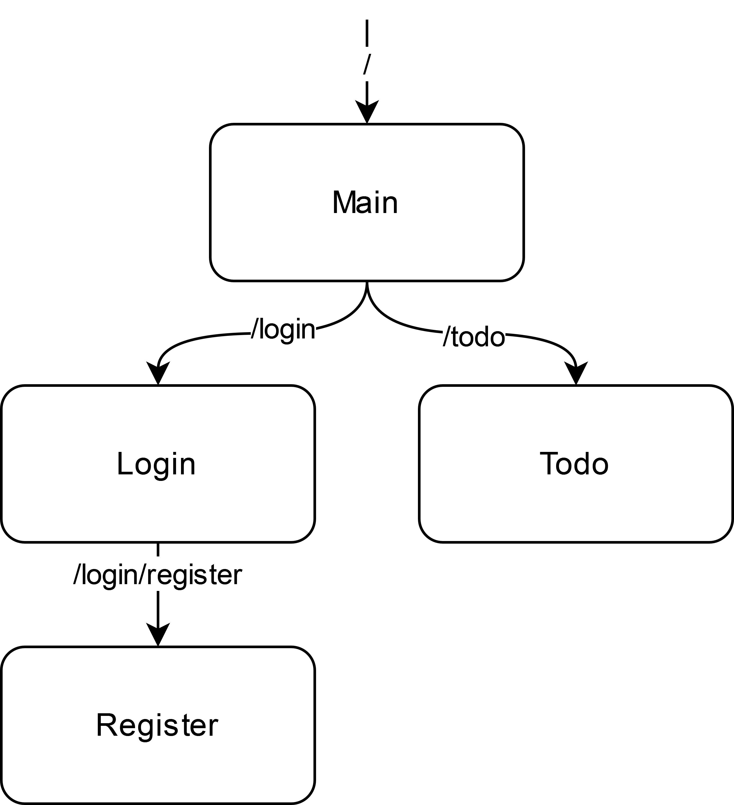

# ☕ JFX Framework

JFX Framework is a versatile Framework for JavaFX applications that is specifically designed for MVC pattern projects.

## ❓ How to start?

To make use of this framework, you need to create an `App` class (e.g., `TodoApp.class`) that extends the `FxFramework`
class and overrides its `start` method. If you already have a JavaFX App class, you can easily migrate by
changing `extends Application` to `extends FxFramework`.

In the `start` method, you should call `super.start(primaryStage)` to initialize the framework. After that, you can
proceed to set up your routes and controllers.

```java
public class TodoApp extends FxFramework {

    @Override
    public void start(Stage primaryStage) {
        try {

            super.start(primaryStage);

        } catch (Exception e) {
            e.printStackTrace(); // Error logging
        }
    }
}
```

## 🎮 Controllers

Controllers are the backbone of your application. To set up a controller, create a class where the controller logic will
be defined and annotate it with `@Controller`.

```java

@Controller
public class TodoController {

    // Empty constructor (for dependency injection etc.)
    public TodoController() {
    }
}
```

### ✨ Initialization, rendering and cleanup

Within your controller class, you have the ability to define methods that are automatically triggered when the
controller is initialized, rendered or destroyed. These methods should be annotated with either `@ControllerEvent.onInit`
or `@ControllerEvent.onRender` to specify their respective execution points.

```java

@Controller
public class TodoController {

    // Empty constructor (for dependency injection etc.)
    public TodoController() {
    }

    @ControllerEvent.onInit
    public void thisMethodWillBeCalledOnInit() {
        // Called when the controller is initialized
        System.out.println("Controller initialized");
    }

    @ControllerEvent.onRender
    public void thisMethodWillBeCalledOnRender() {
        // Called when the controller has been loaded and is ready to be displayed
        System.out.println("Controller rendered");
    }

    @ControllerEvent.onDestory
    public void thisMethodWillBeCalledOnDestroy() {
        // Called when the controller is being cleaned up
        System.out.println("Controller destroyed");
    }
    
}
```

The initialization of a controller takes place when the controller is created, just before it is fully loaded. During
this phase, you may not have access to elements defined in the corresponding view.

On the other hand, the rendering of a controller occurs when the controller is fully loaded and ready to be displayed.
At this stage, you have full access to all elements defined in the corresponding view.

### 🎫 Parameters

To pass arguments to a controller, you can provide an additional argument to the show method, consisting of a map of
Strings and Objects. The Strings specify the argument's name and the Objects are the value of the argument. For example,
`show("/route/to/controller", Map.of("key", value))` will pass the value `value` to the argument `key`.

To use a passed argument in a field or method, you have to annotate it with `@Param(name = "...")`. The name of the parameter
will be used to match it to the map of parameters passed to the `show()` method.

In order to pass arguments to the following controller, the method `show("/route/to/controller", Map.of("fofo", myFoo, "baba", myBa))`
would have to be called.

```java

@Controller
public class FooController {

    private Foo foo;
    
    // The parameter 'baba' will be injected into this field before the controller is initialized
    @Param(name = "baba")
    private Bar bar;
    
    // Empty constructor (for dependency injection etc.)
    public FooController() {
    }

    @ControllerEvent.onRender
    public void render(@Param(name = "fofo") Foo foo) {
        // The parameter 'fofo' will be passed to this method upon rendering
        this.bar = foo; 
    }
    
}

```

## 📷 Views

Each controller is associated with a view, which is composed of one or more nested JavaFX elements (panes, buttons,
labels, etc.). You have four different options to define the view of a controller:

### 📎 Using FXML to define the view

Create an FXML file with a name based on the controller class (e.g., `TodoController` --> `todo.fxml`) and place it in
the 'resources' directory at the same path as your app class.

You can also define a custom FXML path to load instead by setting the `view` path in the `@Controller` annotation. Note
that the entered path will always be relative to the path of your app class in the `resources/` directory.

```java

// Leaving 'view' blank will use the default file name (e.g. TodoController --> todo.fxml)
@Controller(view = "view/todo.fxml")
public class TodoController {

    // Empty constructor (for dependency injection etc.)
    public TodoController() {
    }
    
}
```

When displaying this controller, the framework will automatically load the corresponding FXML file and set it as the
view.

This method is only viable for displaying main controllers as sub controllers have to be a JavaFX element. Therefore, it
is recommended to use one of the following methods.

### ☁ Using JavaFX elements to define the view

If the controller class extends from a JavaFX Parent (or any class extending from Parent), the view will be set to the
element the controller represents. You can use this to create simple views without the need for an FXML file. More
complex views should not be created this way. Instead, you should use the `fx:root` tag (see below).

```java

@Controller
public class TodoController extends VBox {

    // Empty constructor (for dependency injection etc.)
    public TodoController() {
        this.getChildren().add(new Label("Hello World"));
    }
    
}
```

When displaying this controller, the framework will automatically set the view to the VBox element, including all the
modifications like added children, etc.

### 💾 Using JavaFX Root elements (recommended)

The previously mentioned methods can be combined by using
the [`fx:root` tag](https://openjfx.io/javadoc/20/javafx.fxml/javafx/fxml/doc-files/introduction_to_fxml.html#root_elements)
in the FXML file. This way you can use the FXML file to define a more complex view and the JavaFX element to add
additional functionality. This will also be very helpful when using the controller as a sub-controller.

```java

@Controller(view = "view/todo.fxml")
public class TodoController extends VBox {

    // Empty constructor (for dependency injection etc.)
    public TodoController() {
    }
}
```

```xml

<fx:root type="VBox" fx:controller="io.github.sekassel.todo.TodoController">
    <Label text="TODO"/>
    <Label fx:id="todoLabel"/>
    <Button fx:id="deleteButton" mnemonicParsing="false" text="Remove"/>
</fx:root>
```

When displaying this controller, the framework will automatically load the corresponding FXML file and set your
controller as the controller of the root element. The root element will then be set as the view of the controller.

### ⚙ Using a method to define the view

If, for some reason, you need special loading logic, you can also define the view by creating a method in the controller
class that returns a JavaFX parent element (e.g., `Pane`, `Button`, `Label`, etc.). This method will be called when the
view is loaded.

You can define the method you want to use by setting the method in the `@Controller` annotation, starting with a '`#`'.

```java

@Controller(view = "#renderThis")
public class TodoController {

    // Empty constructor (for dependency injection etc.)
    public TodoController() {
    }

    public VBox renderThis() {
        return new VBox(new Label("Hello World"));
    }
}
```

## 🌍 Routes

Routes are the way to navigate between views. To set up routes to different views, you have to create a class where the
routes will be defined.

Inside the class, you have to create a field for each route you want to define. The field has to be annotated with
`@Route(route = "...")` and has to be of type `Provider<T>`, where `T` is the controller which should be displayed at
the
route.

If the path of the route isn't specified, the name of the field will be used as the route name.

The example below uses Dagger to inject the controllers into the routing class. If you don't want to use dependency
injection, you can also create the providers manually.

```java

public class Routing {

    @Inject
    @Route(route = "")
    public Provider<MainMenuController> main;

    @Inject
    @Route(route = "/login")
    public Provider<LoginController> login;

    @Inject
    @Route(route = "/login/register")
    public Provider<RegisterController> register;

    @Inject
    @Route // Route name will be '/todo'
    public Provider<TodoController> todo;

    public Routing() {
        // Empty constructor (for dependency injection etc.)
    }

}
```

This setup will result in the following routing tree:



After setting up the router class, register it in the `FxFramework` class by calling the `router().registerRoutes()` method.
It is recommended to use dependency injection (module/component) to provide a router instance to the method.

## 🖥 Displaying controllers

To display a controller, you have to call the `show()` method of the `FxFramework` class and pass the route.

```java
public class TodoApp extends FxFramework {
    @Override
    public void start(Stage primaryStage) {
        try {

            super.start(primaryStage);
            show(""); // Start in the Main Menu

        } catch (Exception e) {
            e.printStackTrace(); // Error logging
        }
    }
}
```

The route works like a file system and is therefore relative to the currently displayed controller if it doesn't start
with a '`/`'. If you want to display a controller from the root, you have to start the route with a '`/`'. The route
also supports path traversal (e.g., '`../login`'). This can be used to create a back button.

```java

@Controller
public class TodoController {

    @FXML
    Button backButton; // Button is specified in the FXML file

    @FXML
    Button todoButton; // Button is specified in the FXML file

    // Empty constructor (for dependency injection etc.)
    public TodoController() {
    }

    @ControllerEvent.onRender
    public void addButtonAction() {
        this.backButton.setOnAction(event -> show("../"));
        this.todoButton.setOnAction(event -> show("/todo"));
    }
    
}
```

The `show()` method could be overwritten to provide additional functionality like having multiple screens on top of each 
other (e.g. a sidebar or toolbar) or to add custom display logic.

If you just want to listen to a controller being displayed and don't want to change the display logic, you can use the
overwrite the `onShow()` method instead.


## ⌚ History

The framework also provides a history of visited routes. The history acts like a stack and can be
used to go back and forth between previously visited routes. The history is automatically updated when using the `show` 
method. The history works like the history of a browser, meaning you can go back and forth again, but after going back
and visiting an alternative route, the routes that were previously in the history will be removed.

The history can be navigated using the `back()` and `forward()` methods of the `FxFramework` class.

## 🤚 Providing controllers

If you want to show a controller without using the routing system with controllers and sub-controllers, you can use the 
`provide` method of the `FxFramework` class. This method takes a controller class and returns an instance of the controller. 
This instance can then be used to display the controller using JavaFX. This only works for controllers extending from `Parent`.

Controllers provided this way will not be recognized by the routing system and therefore will not be destroyed automatically.
If you want to destroy the controller, you have to do it manually, for example by calling `destroy()` on the controller
in the `FxFramework` class.

## 🧵 Sub-Controllers

Controllers can be used inside other controllers to create reusable components. This can be done by using the
`@Providing` annotation on a field of type `Provider<T>` in your routing class, where `T` is the controller which should
be displayed. You only need on providing field per controller, even if you want to display it multiple times.

In order to display a sub-controller, open the FXML file of the parent controller and add the sub-controller as an
element like this:

```xml
<?import io.github.sekassel.jfxexample.controller.TodoController?>
        ...
<TodoController fx:id="yourid" onAction="onActionMethod" ... />
```

Depending on the parent you extended from, all attributes/properties available for this parent can be set for your
custom controller element as well.

## 🚮 Destroying controllers

When a controller is no longer needed, it should be destroyed to free up resources. This will automatically happen when
a new controller is shown using the `show()` method. However, if you for example subscribe to observables, the framework 
will not clear them up them automatically. You should therefore save the disposables of your subscriptions and dispose them
when the controller is destroyed. 

This can be done by creating a `CompositeDisposable`, adding all disposables to it and then calling `compositeDisposable.dispose()` 
in a `@ControllerEvent.onDestroy` annotated method. 

The framework also provides utility classes for dealing with subscriptions and other mechanisms requiring cleanup. 
By creating a new `Subscriber` instance (or by using dependency injection to provide one) and using its utility methods, 
you can easily manage subscriptions without having to worry about disposing them. When the subscriber exists in form of
a field in the controller, it will be automatically disposed when the controller is destroyed. Otherwise it has to be manually
destroyed by calling `subscriber.dispose()`.

```java

@Controller
public class TodoController {

    @Inject
    Subscriber subscriber;
    
    @Inject
    TodoService todoService;

    // Empty constructor (for dependency injection etc.)
    @Inject
    public TodoController() {
    }

    @ontrollerEvent.onRender
    public void onRender() {
        this.subscriber.subscribe(this.todoService.getTodos(), todos -> {
            // Do something with the todos
        }); 
        this.subscriber.addDestroyable(() -> {
            // Add custom logic to be executed when the controller is destroyed
        });
    }
    
    @ControllerEvent.onDestroy
    public void onDestroy() {
        this.subscriber.destroy();
    }
    
}
```

## 🔁 For-Loops

For-Loops can be used to easily display a node/sub-controller for all items in a list. Whenever an item is added to or
removed from the list, the list of nodes updates accordingly.

The easiest form of a For-Loop can be achieved like this:

```java
For.controller(container, items, ExampleController.class);
```

This will create an `ExampleController` for each item in the list `items` and add it to the children of
the `container` (e.g. a VBox).

Currently, no information is passed to the created controller. In order to pass static information you can add
parameters like you would when using the `show`-method using a map.

```java
For.controller(container, items, ExampleController.class, Map.of("key", value));
For.controller(container, items, ExampleController.class, params); // Parameters can be taken from the @Params annotation for example
```

If you want to pass dynamic information like binding the item to its controller, you can use an `Initializer`.
The `Initializer` allows to
define actions for initializing each controller based on its item.

```java
For.controller(container, items, ExampleController.class, (controller, item) -> {
    controller.setItem(item);
    controller.foo();
    controller.bar();
});

For.controller(container, items, ExampleController.class, ExampleController::setItem); // Short form using method references
For.controller(container, items, ExampleController.class, Map.of("key", value), ExampleController::setItem); // Static and dynamic information can be passed together
```

Instead of a controller you can also define a basic JavaFX node to display for every item.

```java
For.node(container, items, new Button("This is a button!"));
```

When using nodes, the framework will create a copy of the provided node to display for every item. The copies usually
contain all required information except for bindings.

```java
For.node(container, items, new Button("This is a button!"));
For.node(container, items, new VBox(new Button("This is a button!"))); // Nodes can have children
```

Unlike with controllers, it is not possible to pass static information in the form of paramters to nodes, as there is no
way of accessing them in the code. However, dynamic
information in the form of an `Initializer` can be used just like with controllers.

```java
For.node(container, items, new Button(), (button, item) -> {
    button.setText("Delete " + item.name();
    button.setOnAction(event -> items.remove(item));
});
```

As JavaFX by itself doesn't support the duplication of nodes, the framework implements its own duplication logic in the
form of `Duplicator`s. The framework includes duplicators for most of the
basic JavaFX elements like Buttons, HBoxes, VBoxes and more. If you need to duplicate an element which isn't supported
by default, you can create a custom `Duplicator` and register it in the `Duplicators` class.

In order to destroy controllers generated by the For-loops, you can use the `dispose()` method of the `For` class or add
the return value of the `disposable()` method to your list of disposables.


## ↘ Call order

Since the framework differentiates between initialization and rendering, different methods annotated
with `@ControllerEvent.onInit` or `@ControllerEvent.onRender` are called at different times.

The framework has a general rule of **initialization before rendering**, meaning you cannot access most JavaFX
elements (for example nodes defined in an FXML file) in the init methods as the elements aren't loaded before the
rendering.

When using sub-controllers or For-Loops, the order of operations is a bit more complex. At first the main controller
will be initialized. After the controller has been initialized, all sub-controllers will be loaded and therefore
initialized. This will happen recursively until a sub-controller doesn't have any sub-controllers. After that, the
sub-controllers will be rendered, going back up to the main controller. The main controller will be rendered, after all
the sub-controllers have been rendered.

If a For-Loop is defined in a method annotated with `@Controller.onRender` in any (sub-)controller,
the `@Controller.onRender` will (obviously) be called first. After that, the `Initializer` of the for-Controller will be
called and then the for-controller will be initialized and then rendered.

#### Example

```java

@Controller()
public class Controller {

    // Constructor, elements etc.
    // This controller has a subcontroller defined in the FXML file

    @ControllerEvent.onInit
    public void onInit() {
        System.out.println("onInit Controller");
    }

    @ControllerEvent.onRender
    public void onRender() {
        System.out.println("onRender Controller");
        For.controller(container, items, ForController.class, (controller, item) -> System.out.println("Initializer ForController"));
    }

}
```

```java

@Controller()
public class SubController {

    // Constructor, elements etc.
    // This controller has another subcontroller defined in the FXML file

    @ControllerEvent.onInit
    public void onInit() {
        System.out.println("onInit SubController");
    }

    @ControllerEvent.onRender
    public void onRender() {
        System.out.println("onRender SubController");
    }

}
```

```java

@Controller()
public class ForController {

    // Constructor, elements etc.

    @ControllerEvent.onInit
    public void onInit() {
        System.out.println("onInit ForController");
    }

    @ControllerEvent.onRender
    public void onRender() {
        System.out.println("onRender ForController");
    }

}
```

This setup results in the following outputs:

```
Constructor Controller
onInit Controller
Constructor SubController
onInit SubController
Constructor SubSubController
onInit SubSubController
onRender SubSubController
onRender SubController
Constructor ForController
Initializer ForController
onRender Controller
onInit ForController
onRender ForController
```
