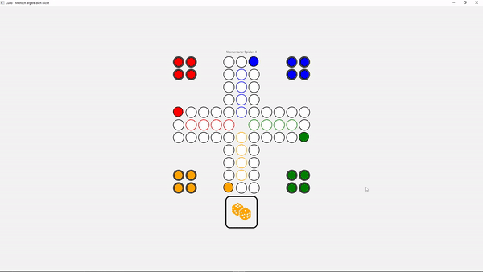

# Keyboard Listener [](https://javadoc.io/doc/org.fulib/fulibFx/latest/org/fulib/fx/annotation/event/OnKey.html)

The framework provides an easy way of registering keybinds for a controller. By using the `@OnKey` annotation, you can
define methods that will be called when a key is pressed.

The annotation has multiple parameters for specifying the key or additional keys (e.g. `shift`) that have to be pressed.
If such an option is set to `true`, the key has to be pressed. If it is set to `false` while `strict` is enabled makes it so that the additional key **must not** be pressed.

For more control, the annotated method can also take a `KeyEvent` as a parameter which will be passed to the method when
the key is pressed.

The annotation can be repeated to allow for multiple input options.

```java

@OnKey()
public void keyPressed(KeyEvent event) {
    // This method will be called when any key is pressed
    // The KeyEvent can be used to get information about the key that was pressed
}

@OnKey(code = KeyCode.ENTER)
public void onEnterPressed() {
    // This method will be called when the enter key is pressed
    // It doesn't matter if shift, ctrl or alt are pressed
}

@OnKey(code = KeyCode.P, shift = true)
public void onShiftP() {
    // This method will be called when the shift and p key are pressed
    // Also works with ctrl, alt and meta (e.g. windows key)
}

@OnKey(code = KeyCode.P, shift = false, strict = true)
public void onNotShiftP() {
    // This method will be called when p is pressed and shift is not pressed
}

@OnKey(code = KeyCode.F)
@OnKey(code = KeyCode.G)
public void onFG() {
    // This method will be called if f or g is pressed
}
```

Other parameters that can be used are `type` (e.g. `KEY_PRESSED` or `KEY_RELEASED`) and `target` which specifies where the event should be
captured. The target can be `STAGE` or `SCENE`.

Using `character` and `text` one can access the raw character that was pressed. `character` will be the character that
would result by pressing the key(s) (e.g. SHIFT + 'a' --> 'A') and `text` will be name of the key that was pressed (e.g. "CTRL" for the ctrl key).



---

[⬅ Call order](9-call-order.md) | [Overview](README.md)
